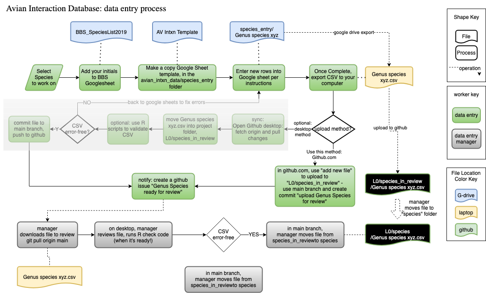

# Instructions for Data Entry in Avian Interaction Database in L0 subdirectory

- NOTES:
  - Refer to the main [**README.md**](https://github.com/SpaCE-Lab-MSU/Avian-Interaction-Database) file in the parent directory of this repository for information about the Workflow and subdirectory naming conventions.

  - Only use GitHub or Google Sheets for data entry and editing of files. *Do not use Microsoft Excel* for data entry or any editing of files; it has text encoding that differs from GitHub and Google Sheets.

## OVERVIEW: Data entry & checking on bird-bird interactions occurs within this L0 portion of the repository. The repository L0 folder contains the following files:

### [**AvianInteractionData_L0.csv**](AvianInteractionData_L0.csv) 
= Entry of all records stitched together with [../R/AvianInteractionData_L0_stitch.R](https://github.com/SpaCE-Lab-MSU/Avian-Interaction-Database/blob/a059edeba78e888432fa36b74948d3a8ac4aa192/R/AvianInteractionData_L0_stitch.R). Each record in this csv file is a unique interaction between 2 species. Note that 2 species can interact in more than one way (equating to multiple rows), and there may be duplicate entries of interactions, each from different species accounts.

### [**AvianInteractionData_metadata.csv**](AvianInteractionData_metadata.csv) 
= Metadata for columns in **AvianInteractionData_L0.csv**.

### [**AvianInteractionData_SpeciesList.csv**](AvianInteractionData_SpeciesList.csv) 
= Species look-up table and assignments for data entry, periodically copied from the Google Drive sheet **AvianInteractionData_SpeciesList** which contains the live updates and assignments of species entry progress.

### [**AvianInteractionData_metadata_interactiondefinitions.csv**](AvianInteractionData_metadata_interactiondefinitions.csv)
= Metadata for interaction types.

### [**AvianInteractionData_metadata_uncertain.csv**](AvianInteractionData_metadata_uncertain.csv)
= Metadata for uncertain interaction keywords.

## Step 1: Get started in GitHub
The first time you use GitHub, do the following: 

- Sign into GitHub and navigate to: https://github.com/SpaCE-Lab-MSU/Avian-Interaction-Database. 

- Install GitHub Desktop (or if you use GitHub command line or github.com, skip this step).

- Clone this entire repository by clicking on the green "Code" button and selecting "Open with GitHub Desktop". Save the location of the repository on your computer (not inside a Google Drive or Dropbox or One Drive folder).

## Step 2: Pull the most recent version of the Database
In GitHub Desktop, select Avian-Interaction-Database. Click "Fetch origin" to pull the most recent version of the database, which will save it to your GitHub location on your computer (established in Step 1). 

## Step 3: Select a Species to Work on
Navigate to the Google Drive folder Avian_MetaNetwork/data/L0/avian_intxn_data and open the **AvianInteractionData_SpeciesList Google Sheet**.  

Select a species that has not been entered yet, fill in your name or initials with that entry in the "recorder" column. 

## Step 4: Create new google sheet for this species. 

 - Open the **species_entry** folder in the google drive folder: **avian_intxn_data**. 
 - Make a copy of the **_avian_intxn_species_template Google Sheet**. You can do this by right-clicking on it and selecting "make a copy" which then makes a new file "Copy of _avian_intxn_species_template". If you want to open first, then save a copy you can do that, but you need to tell it to make it in this folder, not in your home folder.
 - open the copy and rename it for the species you are going to work on with your initials at end, e.g. **Passerina_cyanea_PLZ**.  
 - the sheet is now ready to enter data into, using Google Sheets (not Excel).

## Step 5: Data entry in the Species sheet

- see **[_avian_interaction_example](https://docs.google.com/spreadsheets/d/1YJUwxXWAMTvMIEydpFn-9INOVnkjg4P3EwY1wI5Hco4/edit?gid=0#gid=0)** in the **species_entry** folder in Google Drive for an example entry

a) Set up your Google Sheet created in Step 4. If you use Google Sheets and the view does not freeze the top row, select the top row with the headers, go to “View”, “Freeze”, “Freeze 1 Row”. If your Google Sheet view does not freeze the first 6 columns, select the top row with the headers, go to “View”, “Freeze”, “2 Columns”. Then you can drag the Freeze Column line to cover the next few columns so that the first 6 columns are frozen.

b) Go to **Birds of the World Online** (BOW, via the MSU Library electronic resource portal if you’re off campus). http://ezproxy.msu.edu/login?url=https://birdsoftheworld.org This is the source of natural history information for each bird species entered into the database. 

- FIRST, navigate to the "References" page of the species account (usually the last page on the left-hand menu of the account). Make sure "Order of Appearance" is selected (not Alphabetical).
  -- Example: Northern Flicker: https://birdsoftheworld.org/bow/species/norfli/cur/references

- In the browser on the References page, with a Mac: go to File - Save As - HTML or Page Source (for Mac); or with Windows: Right-click on the page (make sure you are not clicking on a link), and "Save As" "Webpage - HTML Only". You will save a single References HTML file containing all of the references for your chosen species to the Google Drive location: /bow_refs/. Save the file as: "Genus_species_bow_refs_VERSION". for "VERSION" replace with the last value in the species account doi. For example, for Northern Flicker, the BOW references filename would be: "Colaptes_auratus_bow_refs_bow.norfli.02.1.html"

- In general, the best approach to entering the species' data is to open the BOW species account and just skim through it page by page (section by section, in order) for **capitalized species names (often Common Names)** and ***italicized species names (often Genus species)***; this should catch nearly all the entries and will add new ones we missed before. You may see other plain text terms like "passerines" or "corvids" and these refer to entire groups of species in an interaction - these are still important to record and should not be skipped.

c) Enter interactions for the species you selected by designating the selected species in "species1_scientific" and "species1_common" in your file, and the species it interacts with in "species2_scientific" and "species2_common", based on evidence from Birds of the World Online. Refer to [**`AvianInteractionData_metadata.csv`**](AvianInteractionData_metadata.csv) for rules about how to enter each column, and the information below:

**Citations, Source URLs & Text Excerpts**
- Add the BOW citation to the "citation" column. For BOW, this is found at the bottom of each BOW page (simply copy-paste it); it's the same citation for the entire account). For other non-BOW sources (see below for Web of Science / Google Scholar), use the MLA style citation.
  
- For "source_URL" *Important:* you need to copy-paste the full URL for each URL page that has the source(s) of the interaction. Separate URLs are entered in separate rows if there are multiple BOW pages with information on the same interaction (e.g., “behavior” and “Introduction” pages for example). 

 - A full BOW URL looks like this so that “behavior” is visible: https://birdsoftheworld-org.proxy2.cl.msu.edu/bow/species/gofwoo/cur/behavior.

- Refer to the species1 account on Birds of the World Online. Note that the website contains a table of contents with different sections (Introduction, Systematics, Behavior, etc.). Please look through ALL SECTIONS to be sure we catch all interactions with other birds because other sections can contain them also.

- When entering information into the **text_excerpt** column, you must copy-paste enough sentences that capture the context of the interaction AS WELL AS ALL THE INFORMATION APPEARING IN OTHER COLUMNS (e.g., time of year, breeding or migration, etc.). Many times this is copying an entire paragraph or more. First, copy-paste the Section and Heading of the paragraph (e.g., "Behavior: Agonistic Behavior"), then copy-paste the paragraph that includes the interaction. You may have several rows with the same **text_excerpt** and **source_URL** because there are many pairwise interactions from the same text passage. *If the passage of text copied in the **text_excerpt** cells has an old species name, don't change it there. The **text_excerpt** must be entered exactly as it appears in the original text*. Instead, indicate name changes in the **name_changes** column.

- Do not add multiple URLs to a single cell. Each row should reflect the unique information derived from a source and its URL, and text excerpt combination.

- You can also cite pictures and videos featured in the articles! If possible, get the direct link by right-clicking the image/video, or clicking on the image and following the highlighted link (it will usually be from Macaulay Library or eBird). If there is no direct URL, you may use the URL for the BOW page it was found on. For the note, copy any descriptions used in BOW about the image/video, or write a brief description about it.
  
- You may cite sources outside of BOW. For example, if BOW references another resource, or you are unsure about an interaction and need to go to the primary source. BOW will always be your starting point. See **Step 5e** below for how to conduct a systematic search beyond BOW.

- When copying URLs from sources gathered from Google Scholar or Web of Science (**Step 5e**), ensure that the link you provide is the same as the one referenced in the database search page. Scrolling through a PDF on certain libraries can add additional queries to the URL, creating a mismatch when referencing the source in the future. To ensure that you are copying the URL as presented on the database, right-click on the hyperlink and select "Copy link address" before pasting into the source_URL column.

**Names**
- On each section, skim for Italicized words - these are usually *Genus species* names. Occasionally species will be listed in just Capital Letters (e.g., Yellow Warbler). Determine if the description means that species1 is interacting (or has an inferred interaction) with species2. 

- If a specific subspecies is mentioned in reference, then include in species name (*Genus species subspecies*). If not, use *Genus species*.

- - IMPORTANT: For each species mentioned, enter into the spreadsheet the scientific and common names that are *as written* in the source you are reading. Sometimes this name differs from the current name for the species because of name changes. If you do determine that the name *as written* in the source is out of date, you can add a note in the "name_changes" column (e.g. "article uses scientific name Picoides pubescens for Downy Woodpecker; current BOW name is Dryobates pubescens").
  - Officially, we follow the Clement's Checklist, which is updated at least yearly, but this step is done in R code after the initial data entry. 
  
- If the article does not mention a specific species but does reference a group (e.g. "corvids", "gulls", etc.), then enter species2 as an unidentified species. For the common name, use "unid." + group mentioned, and for scientific name, use the smallest taxonomic group that captures all members of that group. For example, "corvids" would be entered as common name "unid. corvid", and scientific name "Corvidae sp.". Ask a reviewer (Phoebe or Caroline) if you are unsure how to enter this.

- If the article addresses a bird as *Genus subspecies* rather than *Genus species subspecies* (e.g. *Mimus orpheus* instead of *Mimus polyglottos orpheus*), enter into species1 and species2, and indicate a note about the likely species in the name changes column.

- If the article uses characters from scripts outside of the English alphabet (e.g. æ, Ø, or Þ), copy paste into the species column exactly as written and include a note about the likely species in the name changes column. When exporting to CSV, double-check that the character looks the same.

**effect_sp1_on_sp2, effect_sp2_on_sp1, Interaction**
- Refer to the unique types of interactions found here:
[**AvianInteractionData_metadata_interactiondefinitions.csv**](AvianInteractionData_metadata_interactiondefinitions.csv). Enter in the appropriate interaction type, as well as the direction of the interaction specific to each species. Be careful to place the correct value in the effect columns.

- A note about **"co-occur"**: Co-ocurrence is limited to species that are found in the same place at the same time. If a study was done in a certain place (over a certain time), then you can reasonably assume the birds were co-occuring. Or if a statement says, "species1 is often found with species2" and there is no information on how they interact exactly, "co-occur" is the interaction. Examples of when NOT TO ENTER "CO-OCCUR": if you find a checklist of birds in an area, or a description of birds found in an area (these are too vague). As always, if you have questions on interpreting, ask Caroline or Phoebe.  

**Interaction Strength**
- For “weak” vs. “strong” interactions, this can be less clear. Here are some guidelines:
Enter “weak” if the description is vague, mentions that it is a “possible” or "likely" (but not observed) interaction, rare interaction, or inferred interaction.
Enter “strong” if the interaction was observed, or was strongly stated (i.e., "species 1 *often* found competing with species 2").

**Species1_lifestage Species2_lifestage**
- Species can vary in the life stages involved in the interaction. Enter the lifestage appropriate to the interaction, per species. It may differ or be the same. For example, with Brood Parasites, the interactions involved include BOTH adult and nestlings. *Egg* would be unborn individuals. *Nestlings* are individuals who have hatched and remain within a nest. *Fledglings* are young who have fledged but are not yet old enough to fend for themselves. *Juvenile* is a stage following fledgling but not yet fully mature *Adult*. If there are multiple lifestages for a given species, enter them in the same cell, separated by ";".
  
**Time of year**
- Enter the time of year that the interaction occurs in. This should be month(s), seasons, or "year-round". If nothing is reported, go to the original source to determine the time of year. If you are unsure of what timeframe the interaction occurs in, check with a reviewer (Phoebe or Caroline). *Note: **hybrid** does not need a time of year entry*. 

**Breeding Migration**
- Enter the life history timing of the interaction (year-round, migration, breeding, non-breeding) or some combination separated by ";" (e.g., breeding; migration). For example, if the interaction occurs during the non-breeding season (typically winter), indicate "non-breeding". If the article mentions a month, you can check if it occurs during species1 breeding season using the phenology diagram (usually on the Introduction or Breeding page), or reading the Breeding page. The middle ring in the diagram in the breeding period. If you are unsure of what timeframe the interaction occurs in, check with a reviewer (Phoebe or Caroline). *Note: **hybrid** does not need a breeding or migration entry*. 

**Uncertain Interactions**
- If there is any uncertainty about the interaction, enter the appropriate uncertain interaction keyword from [**`AvianInteractionData_metadata_uncertain.csv`**](AvianInteractionData_metadata_uncertain.csv). You may add additional information to the uncertain_interaction column, but make sure that the note includes an uncertain keyword that is spelled correctly (the R code will look for these keywords specifically in order to determine whether or not to keep the interaction in further analysis). If you are unsure which keyword to use, you can leave a comment and ping a reviewer, or make a note when you create an issue (Step 8).

- If there is an interaction that gives a list of potential, but uncertain, involved species, include rows for all species mentioned, rather than their shared genus or family. For example, when documenting "...who noted a pair refurbishing an old oriole nest, likely built by either Spot-breasted Oriole (Icterus pectoralis) or Altamira Oriole (Icterus gularis)," include rows for both the Spot-breasted Oriole and the Altamira Oriole.

- If there is an interaction that you are unsure of how to classify (confusing wording or it mentions multiple species and you aren't sure which it applies to), try and find the original source. BOW articles commonly include sources after every sentence, either as a in-text citation or a highlighted number you can click to get more information. Copy the citation (title, author, and year are typically enough) and search for it using MSU Library database or Google Scholar to see if the original text provides any clarity on the interaction. If you can't find the original or it does not help clarify, you can ping a reviewer or make a note when you create an issue (Step 8).

**Multi-species interactions**
- If you find a description that lists > 2 species involved in an interaction (e.g., mixed flock, aggregate foraging, competing over same resource), then enter in all pairwise interactions into the same google sheet. Indicate in the **other_species1** column that the species1 of that row is different from the file name/article title.

**Artificial Interactions**
- If you encounter a description of an interaction that was induced by human researchers (e.g., a bird responded to the playback of another species' call, or two species were recorded courting in captivity, or a bird ejected eggs of another species that were placed in its nest by humans), attach the "-artificial" modifier to the end of the interaction (e.g., courtship-artificial). Keep the values for symmetry and effect on each species the same as the interaction being modified.
  
**Name Changes**
- Bird names change through time, sometimes fairly often. If the row contains a species1 or species2 bird with any kind of name change (whether Scientific or Common or both), write a note in this column explaining the name change. If it is difficult to determine which species was involved in the interaction because of a name change, also indicate that in the **uncertain_interactions** column.

**Abbreviations and Codes**
- If you encounter a 4-letter banding abbreviation (e.g. GHOW) or other acronym or code for mentioning a bird, copy and paste the text excerpt where the abbreviation is defined (e.g., "Great-horned Owl (GHOW)...") into the **text_excerpt** column in every row where an interaction was derived from a text excerpt that includes an abbreviation.

**Other**
- Note that for species1, its interaction with species2 will become part of species2’s pairwise interactions. NOTE: if a duplicate entry occurs, it’s ok (we will edit in R). It takes too much time to avoid duplicates by manually searching for the species2 entries that already exist.

- Scientific names change more often than common names, and sometimes it is difficult to find which one is appropriate. If you don't know, please ask a reviewer (Phoebe or Caroline). 

- For BBS birds, don’t worry about AOU number being blank for some species (also fillable later in the workflow by R). 

d) When you have finished adding all new entries in your new Google Sheet for a species1 and its interactions with species2:

- Update "BBS_InteractionPairs_entry" column in the Google Sheet **AvianInteractionData_SpeciesList** with a new date (add date to an existing date: e.g., 3/3/2014-11/23/2021, or just add the date if there is no date there already). Paste in the citation for the BOW_citation in **AvianInteractionData_SpeciesList**. This can be found at the bottom of each webpage of the species’ BOW record.

e) You will need to perform an additional search outside of BOW to identify primary literature and other sources online. Below is an example for [**Pyrilia haematotis, the Brown-hooded parrot**](https://birdsoftheworld-org.proxy1.cl.msu.edu/bow/species/brhpar1/cur/introduction).
  
  - (i) Start in Birds of The World - follow instructions above (5a-d).
  
  - (ii) Use Web of Science. Navigate to the MSU WOS subscription: [https://www-webofscience-com.proxy1.cl.msu.edu/wos/alldb/basic-search](https://www-webofscience-com.proxy1.cl.msu.edu/wos/alldb/basic-search).
    - Make sure that "All Databases" and "Topic" are selected for the search. 
    - Enter into the search, the species' Common name surrounded by quotes, then OR, then the species' scientific name(s), each surrounded by quotes. Work through 5a-d above for all articles returned. If you cannot access certain sources, Google them to see if you can access them online outside of MSU. 
      - **EXAMPLE:** Enter **"Brown-hooded parrot" OR "Pyrilia haematotis"** into the searchbar.
      - Uncheck "NOT Database: Preprint Citation Index". Click to remove this refine from your search. We want to include preprints.
    - Make note of any sources that were returned in the search but are not accessible via MSU or Google by entering in the relevant information into the Google Sheet [inaccessible_avian_literature](https://docs.google.com/spreadsheets/d/1I2F4vM05t0BGF4e8RHGDkGT3quRBlTonAAbIvrEdotg/edit?gid=0#gid=0) in the literature_search folder on Google Drive.; it is possible we can find them via Interlibrary Loan.
    - Once a source is open, search in it using ctrl-F (PC) or command-F (Mac) for the species names - Common and Scientific - this will allow you to find mention of the species and read sections where it is mentioned to uncover potential interactions. If the source is about the species, then search as you would through the BOW account (skim for capitolized and/or italicized species names). **Important:** if you find descriptions of other species' pairwise interactions in a source, please enter them, and indicate that it is a different species1 (see above).
    - Refer to **Step 5c** when copying URLs from WOS.

   
  - (iii) Perform a **Google Scholar Advanced Search** to identify primary literature and other sources online. Navigate to [**Google Scholar**](https://scholar.google.com).
    - Navigate to the Settings by selecting the 3 horizontal lines at the upper left of the page. Click on **Settings**. Select **Languages** and click the option that says "Search only for pages written in these languages." Check "English."
    - Navigate to the Advanced Search by selecting the 3 horizontal lines at the upper left of the page. Click on the **Advanced Search**. Into the cell next to **Find articles with all of the words** paste all the species current and past names for both Common and Scientific names (see the BOW account section "Systematics History" to find these names), in quotes, separated by OR. *If you have questions about the alternative or former names of the species, please consult with Phoebe before conducting the search since the Systematics History section of accounts can be confusing*. Note that you do not have to add subspecies. Note also that capitalization doesn't matter and neither do hyphens (i.e., "Brown-hooded parrot" will return the same results as "Brown hooded parrot". Also, if you leave off OR, it will be interpreted as AND, requiring all of the text strings to appear in the search result.
    - Example text (don't forget the quotes, OR) to enter into Google Scholar Advanced Search "Find articles with all of the words" (note that this species has not had a name change):
    - **EXAMPLE: "Pyrilia haematotis" OR "Brown-hooded parrot"** - [this search yielded 216 results](https://scholar.google.com/scholar?as_q=&as_epq=&as_oq=%22Brown+hooded+parrot%22+%22Pyrilia+haematotis%22&as_eq=&as_occt=any&as_sauthors=&as_publication=&as_ylo=&as_yhi=&hl=en&as_sdt=0%2C23).
    - *If this does not turn up any results, try searching just Common or Scientific name separately.*
  
    - Press Enter or the Search icon to the right of the search bar. This will return a set of papers and other reference literature.
    - *IMPORTANT: If nothing results from this more involved search, check how Google Scholar is coding your search in the searchbar - sometimes it adds "AND" "OR" many times between words, which is incorrect. Click on Advanced Search to see how it is coding your search - fix any errors.*
    - Once the search returns results correctly, read the titles and if you recognize the same source you already entered in (ii) or (iii), you can skip these since you already entered them. You can also skip over checklists, which just list birds and do not describe interactions. Click on each potential source in order and navigate to the source (you may have to click on "All Versions" below the source to find a PDF or accessible link). If the source is a book, try to find an electronic version (e.g., you may be able to search in Google Books).
    - As above with WOS, search in the text for the species to find where it is mentioned.
    - Refer to **Step 5c** when copying URLs from Google Scholar.

  - (iv) Search other species account sources. Note that hopefully these sources have mostly been incorporated into BOW already, but please check to make sure, given that your species has few or no interactions on BOW: 
    - Search Bulletin of the (**British Ornithologists’ Club**)[https://bioone.org/journals/bulletin-of-the-british-ornithologists-club] [Search in the search bar in upper right] - this is not indexed and may not appear in search results in the databases above.
    - If your species is a **Duck, Goose, or Swan**, please check the species accounts in this source for any previously-unrecorded interactions. Johnsgard, P. A. [Ducks, geese, and swans of the world](https://digitalcommons.unl.edu/cgi/viewcontent.cgi?article=1000&context=biosciducksgeeseswans). (University of Nebraska Press, 1978).
    - If your species occurs in **Australia, New Zealand, or Antarctica**, please search this source: Merchant, S. & Higgins, P. J. [Handbook of Australian, New Zealand and Antarctic Birds](https://hanzab.birdlife.org.au/). (Oxford University Press: Melbourne, 1990). https://hanzab.birdlife.org.au/ - sign up for an account with BirdLife to access this freely.
  
  - (v) For all the searches above, enter any interspecific interactions you find, as in 5a-d above, following the BOW protocol. Copy-Paste the Citation (with DOI) of the source and also include the URL for that source in the **source_URL** column for each source, but this time copy-paste the MLA style citation for the primary source using the Cite link below the source on Google Scholar or the citation from WOS. 
  - (vi) Be sure to Save (copy-paste) the URL for the Google Scholar or WOS Search Results and paste that into the **DatabaseSearchURL** column in the **_avian_intxn_species_template**. This entry will be the same for all results coming from this particular search.
  - (vii) If you are entering a species with more interactions, that already has a GitHub issue stating it has no interactions (or needs more), then first push and commit the .CSV version of the interaction data (Step 6 & Step 7 below) and THEN find the old issue by searching in this repository for the issue (enter the species name into the search bar at the top of the repository). Once you find the old issue, update it by changing its name (Edit on Right-hand side) to remove the text about no interactions. Then also add a comment to the issue that states the interactions have been entered using Google Scholar. The issue will later be resolved once the usual checking occurs.

## Step 6: Export/Download to CSV

When you've completed entering the all interactions in your google sheet, it needs to be incorporated into the collection of species files in GitHub. To do that, export your spreadsheet to CSV, which downloads it to your desktop. You will most likely need to rename the CSV file that's downloaded to your computer. Name it for the species and add your initials, e.g. **Passerina_cyanea_PLZ.csv**.    
  
In the future it will be possible to run a program to check your file for correctness, but for now you may upload as is. **IMPORTANT: Don't open and save the CSV file from Excel, which adds incompatible characters.**  

## Step 7: Upload CSV to GitHub. 

Open the repository https://github.com/SpaCE-Lab-MSU/Avian-Interaction-Database-Working/tree/main/L0/species_in_review and click the **[Add file]** button. That button has two choices, select "Upload files".   

Here is a shortcut link to that upload form: https://github.com/SpaCE-Lab-MSU/Avian-Interaction-Database-Working/upload/main/L0/species_in_review

You may drag the CSV file, or click the "choose your files" option to select it. 

- In the form below where is says "commit changes", type in a message indicating the file is ready: e.g., 

`Passerina_cyanea_PLZ.csv ready for review`   

- If there is anything that has happened that you need to note (e.g., you weren't able to complete all rows, or there is some data issue you can't overcome, add that to the "optional extendend description" box. Most likely you won't need this, but it's there to communicate anything about this file that you need to. 

- Leave the option "Commit directly to the main branch" selected.

- Click the green "commit changes".

## Step 8: Notify us that file is ready by creating a GitHub issue

*(Note: we are no longer using pull requests since we are using seperate species files for this process)*

Open a new "issue" (which is like a task) and indicate that the file is waiting for review.  For more information on issues, see https://docs.github.com/en/issues/tracking-your-work-with-issues/creating-an-issue

The direct URL to create a new issue in this repository is:  https://github.com/SpaCE-Lab-MSU/Avian-Interaction-Database/issues/new

Otherwise, if you are in any folder in the GitHub Avian-Interaction-Database repository, click the "issues" link near the top left.   Once there, click the green "New Issue" button.

The title of the issue should contain the name of your species and indicate it's ready.  For example *"Passerina_cyanea_PLZ.csv ready for review"*

You don't need to enter a comment, unless you want to communicate any issue you encountered related to the data entry to the person who will be reviewing your file.   

If you have an issue you want to make sure the reviewer sees, in the "assignees" section on the right, select reviewer by clicking the 'gear' icon and entering their GitHub name. This sends an email to reviewer that it's ready (which is a lot of communication!)

## Step 9: Entry checking

All species files should be reviewed by a second person to look for errors and make sure there is consistent interpretation of the text. The reviewer will go into the original Google Sheets file, correct any errors, and add their name and date to the file. They will then reupload the new file into the species folder, and remove the old version. Reviewers, see below section for more details on checking process.

## Step 10: View changes made by the reviewer (changes usually made by Emily or Phoebe)

You will want to view any changes that were made by the reviewer to understand different interpretations and corrections. This will help with learning how to correctly enter the data in the first place, and also provide a way to discuss any discrepencies. To see what was changed between the species' CSV file placed into `/L0/species_in_review` folder and the fully reviewed version CSV placed into `/L0/species` folder, do the following: open the Google Sheet version of the species' file in the Google Shared Drive folder: [/avian_intxn_data/species_completed](https://drive.google.com/drive/u/0/folders/11NAIHD4Jfmd5qtQvKbYdiIXz7yTQu446). Open the species' Google Sheet, click on the edit history (usually an underlined phrase next to the "Help" menu stating, "Last edit was ...". This opens the edit history. Click on the "Version History" on the right to see what Emily or Phoebe changed. Changes show up in a color. Do not restore to a previous version! Once you're done viewing, click the ARROW pointing back to the current version and close the document. **They may also ping you in comments on documents, so be sure to check your email/Google Drive regularly.**

## The below section is for Emily / Phoebe / India only and occurs after Step 9:

When a file is ready to be reviewed:

1) Make sure to Pull ("Fetch" on GitHub Desktop).  If you have files you've edited but not comitted you'll have to commit first (but not push).  This will download the new files from `L0/species_in_review` folder

2) If you have made other changes, push those now if you'd like.  

3) To ensure that the changes are tracked and easy to observe, navigate to the Google Sheet version of the species' file in the Google Shared Drive folder: [/avian_intxn_data/species_entry](https://drive.google.com/drive/u/0/folders/11NAIHD4Jfmd5qtQvKbYdiIXz7yTQu446). 

4) If there are errors, correct them and document changes in "entry_changes" column. Be sure to check every cell for errors. If there is a error you notice is repeated (e.g. always missing non-breeding season, wrong URLs), or you have a question about an entry, you can ping the original author and other reviewers in a comment.
   
a) If there are old scientific (or common) species' names, make sure they are updated in the species1/2 column, and there is a note in the "name_changes" column. Check the `bbsbow_names.csv`, and update if the scientific name change has not been documented. If documented, update the checked date.

b) If there are multiple old/outdated scientific names that can be used for one of the species1/2 name columns, make separate lines for each. Do not put multiple names in a single cell.

c) Be careful when entering species splits into the file. We use `bbsbow_names.csv` to directly update the files, and we don't want to accidentally overwrite scientific names for other species. For species splits, just enter the scientific name in the "bow" column, and add a note about the species split.

5) Check the original article for any missed interactions, and add them to the file.
   
6) Once all errors are corrected, add your name and date to "recorder" and "entry_date" columns. Save as a CSV and add your initials to the end of the file name, then place the file in the `L0/species` folder. 

7) Commit that change, with message similar to "Acanthis flammea.csv reviewed"  Or "Acanthis flammea.csv reviewed, error corrected".

8) Push that change to GitHub (you may have to pull again first if another file was recently uploaded)
   
9) If a file is less than 5 lines, add a hard line return to the end of the csv in GitHub to avoid errors later in R. Simply open the file in GitHub, and hit Enter at the end of the last line.
   
10) You will also need to remove the old csv from `L0/species_in_review`. This can be done in GitHub desktop by deleting the file in your local directory, or directly on the online version of GitHub. Commit the change (commit message "removing Acanthis_flammea.csv from review folder", or similar), and push change to GitHub. May need to pull again if another file was recently uploaded. 

11) Close the issue that was created for the review. Add a comment or ping only if you feel something needs to be communicated (e.g., if the file has encoding issues you had to correct, there is a comment in the Google Doc you want to make sure they see, or other things out of the ordinary)

12) If there are large problems with the file (i.e. errors that would result in you having to change every line, or you are unable to read the file), you may need to contact the data entry person and have them make corrections in Google Drive and repeat the upload.   

13) When completed, move the original Google Sheet into the Google Drive folder called `L0/species_completed`.  

## Draft Flow Diagram

